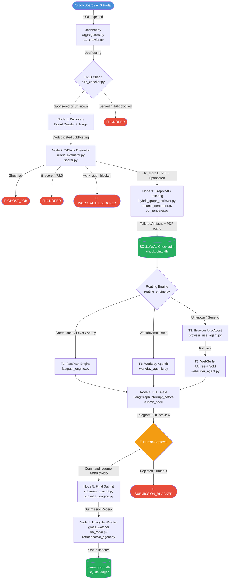

# Operon Job Hunter — ARCHITECTURE.md

**Document Version:** 3.0.0  
**Status:** Contributor Reference  
**Last Updated:** 2026-09-11  

---

## 1. Bird's-Eye Overview

Operon Job Hunter is a **Nested Hybrid Agentic OS** built on LangGraph. It separates concerns into two levels:

| Level | Pattern | Implementation |
|-------|---------|----------------|
| **Macro Orchestration** | Deterministic DAG (prescriptive workflow) | `LangGraph StateGraph` in `src/pipeline/state_machine.py` |
| **Micro Autonomy** | Bounded subagents (≤5 LLM turns each) | Discovery Squad, Evaluator-Optimizer loop, WebSurfer Agent |

All decisions are persisted to SQLite WAL checkpoints, making every run resumable from the exact last valid super-step. Raw pipeline state is pruned to `<10 KB` per checkpoint by stripping transient DOM blobs before serialization.

### Architectural Boundaries at a Glance

```
┌─────────────────────────────────────────────────────────────────────────────┐
│                   Operon Job Hunter — System Boundaries                     │
├──────────────────────┬──────────────────────────────────────────────────────┤
│ Interface Layer      │ FastAPI REST/SSE · Typer CLI · Telegram Bot          │
├──────────────────────┼──────────────────────────────────────────────────────┤
│ Orchestration Layer  │ LangGraph StateGraph · Circuit Breakers · HITL gates │
├──────────────────────┼──────────────────────────────────────────────────────┤
│ Agent / Engine Layer │ 5-stage pipeline · Career Brain · Multi-agent bus    │
├──────────────────────┼──────────────────────────────────────────────────────┤
│ Reasoning Layer      │ LLM Gateway (Alibaba/Gemini/OpenRouter) · GraphRAG   │
├──────────────────────┼──────────────────────────────────────────────────────┤
│ Persistence Layer    │ SQLite WAL · NetworkX Graph · Playwright Browser     │
└──────────────────────┴──────────────────────────────────────────────────────┘
```

---

## 2. Core Request Lifecycle — Mermaid Diagram

The following diagram traces the journey of a single job from discovery to lifecycle monitoring:



---

## 3. Module Codemap — Where Core Logic Lives

### 3.1 Pipeline Stages

| Stage | Directory | Key Files | Responsibility |
|-------|-----------|-----------|----------------|
| **1 Discovery** | `src/pipeline/1_discovery/` | `scanner.py`, `portal_crawler.py`, `aggregators.py` | Crawls 9+ ATS portals concurrently; deduplicates, canonicalizes URLs, applies H-1B and triage filters |
| | | `h1b_checker.py`, `h1b_dataset_manager.py` | Verifies sponsorship against USCIS JSON dataset |
| | | `ghost_job_detector.py` *(in Stage 2)* | Detects and filters stale/scam postings |
| **2 Evaluation** | `src/pipeline/2_evaluation/` | `rubric_evaluator.py` | 7-block rubric scoring per job posting |
| | | `scorer.py` | Aggregates block scores into `fit_score` |
| | | `work_auth_guard.py` | Multi-model consensus voting on visa/clearance eligibility |
| **3 Tailoring** | `src/pipeline/3_tailoring/` | `hybrid_graph_retriever.py` | Multi-hop GraphRAG traversal over NetworkX career graph |
| | | `surgical_optimizer.py` | Evaluator-Optimizer loop with delta patching |
| | | `fact_guard.py` | Hallucination guard — verifies claims against `MASTER_RESUME.md` |
| | | `resume_generator.py` | Orchestrates resume sections from GraphRAG output |
| | | `pdf_renderer.py`, `typst_renderer.py` | Deterministic PDF compilation (ReportLab / Typst) |
| | | `cover_letter.py`, `qa_generator.py` | Cover letter and ATS question synthesis |
| **4 Submission** | `src/pipeline/4_submission/` | `routing_engine.py` | Routes jobs to T1/T2/T3 submitter tiers |
| | | `fastpath_engine.py` | T1: deterministic DOM autofill for known ATS portals |
| | | `browser_use_agent.py` | T2: LLM-driven browser agent for generic portals |
| | | `websurfer_agent.py`, `axtree_parser.py`, `som_annotator.py` | T3: AXTree + Set-of-Marks visual grounding |
| | | `adapters/` | Per-portal adapters: `greenhouse.py`, `lever.py`, `ashby.py`, `workday.py`, `workday_agentic.py`, `generic.py` |
| | | `submission_audit.py` | Records every browser action to SQLite `submission_audit_log` table |
| | | `captcha_handler.py`, `capsolver_client.py` | Captcha detection and auto-solve |
| **5 Lifecycle** | `src/pipeline/5_lifecycle/` | `followup_engine.py` | Schedules follow-up outreach drafts |
| | | `oa_radar.py` | Tracks online assessment invitations |
| | | `retrospective_agent.py` | Post-outcome analysis to improve future evaluation |
| | | `self_healing_agent.py` | Detects and recovers from portal/submission regressions |

### 3.2 Orchestration

| File | Responsibility |
|------|----------------|
| `src/pipeline/state_machine.py` | LangGraph StateGraph — node registration, edge routing, circuit breaker wrapping |
| `src/pipeline/state_schema.py` | `PipelineGraphState` TypedDict with monotonic reducers (`hard_blocks_reducer`, `validation_level_reducer`) |
| `src/pipeline/batch_dispatcher.py` | Batch processing dispatcher for parallel job runs |
| `src/pipeline/sanitizer.py` | State sanitizer / transient pruner before SQLite checkpoint serialization |

### 3.3 Core Infrastructure

| Package | Directory | Responsibility |
|---------|-----------|----------------|
| **LLM Gateway** | `src/core/gateway/` | `facade.py` — tiered routing; `alibaba.py`, `gemini.py`, `openrouter.py` — provider adapters; rate-limit retry in `base.py` |
| **3-Tier Memory** | `src/core/memory/` | Core (in-context RAM), Recall (SQLite WAL via `dual_engine.py`), Archival (NetworkX GraphRAG) |
| **Database** | `src/core/db/` | `schema.py` — DDL init; `repository.py` — CRUD operations; `connection_pool.py` — connection pooling; `error_log.py` — structured error persistence |
| **Credentials** | `src/core/credentials/` | `vault.py` — OS keyring with `keyring`/`env`/`file` backends |
| **Resilience** | `src/core/resilience/` | Circuit breaker decorator (`with_circuit_breaker`), 45s execution budgets |
| **Telemetry** | `src/core/telemetry/` | `agent_ledger.py` — `agent_decisions` SQLite table; Prometheus metrics client |
| **Events** | `src/core/events/` | Domain event bus bridged to Mission Control SSE stream |

### 3.4 Multi-Agent Platform

| File | Responsibility |
|------|----------------|
| `src/agents/discovery_orchestrator.py` | Drives `JobScanner`, emits `JOB_DISCOVERED` events onto domain bus |
| `src/agents/application_agent.py` | Wraps `BatchPipelineDispatcher.process_single_job` off-thread on discovery events |
| `src/agents/outreach/` | LinkedIn outreach drafting behind mandatory approval gate |
| `src/agents/interview/` | Interview prep agent |
| `src/integrations/ats_readonly.py` | Read-only ATS board API enrichment |

### 3.5 Career Brain (Local LLM)

| File | Responsibility |
|------|----------------|
| `src/brain/inference.py` | Main inference loop — mode routing, Ollama client calls, gateway fallback |
| `src/brain/mode_router.py` | Classifies queries into `avatar` / `tailoring` / `qa` inference mode |
| `src/brain/synthesizer.py` | Response synthesis from GraphRAG-retrieved career context |
| `src/brain/validator.py` | FactGuard verification layer for brain responses |
| `src/brain/evaluator.py` | Brain output quality scoring |
| `src/brain/ollama_client.py` | HTTP client for local Ollama inference server |

### 3.6 Web Interface

| Path | Responsibility |
|------|----------------|
| `src/interface/api/routes.py` | FastAPI app — REST endpoints + SSE stream for pipeline state |
| `src/interface/cli/main.py` | Typer CLI — all user-facing commands |
| `src/interface/bot/` | Telegram bot — HITL approval notifications with inline PDF preview |
| `web/career_graph_viewer.html` | D3.js career knowledge graph visualization |
| `web/templates/` | Jinja2 templates for Mission Control 2.0 dashboard |

---

## 4. Database Schema

All tables live in `data/careergraph.db` (SQLite, WAL mode). LangGraph checkpoints use a separate `data/checkpoints.db`.

### 4.1 Core Tables

```sql
-- jobs: Central job posting registry
CREATE TABLE jobs (
    id          TEXT PRIMARY KEY,
    company     TEXT NOT NULL,
    title       TEXT NOT NULL,
    url         TEXT NOT NULL,
    portal_type TEXT DEFAULT 'generic',     -- greenhouse | lever | ashby | workday | generic
    source      TEXT DEFAULT 'scanner',
    status      TEXT NOT NULL DEFAULT 'discovered',  -- see JobStatus enum
    location    TEXT,
    description TEXT,
    h1b_sponsored  INTEGER,                 -- 0/1/NULL
    posted_at   TEXT,
    discovered_at TEXT NOT NULL,
    created_at  TEXT,
    updated_at  TEXT,
    raw_data    TEXT                        -- JSON blob of original scrape
);

-- evaluations: Stage 2 rubric results
CREATE TABLE evaluations (
    id               TEXT PRIMARY KEY,
    job_id           TEXT NOT NULL REFERENCES jobs(id) ON DELETE CASCADE,
    fit_score        REAL NOT NULL DEFAULT 0.0,
    score            REAL,
    reason           TEXT,
    block_scores     TEXT,                  -- JSON: {block_name: score}
    work_auth_blocker INTEGER DEFAULT 0,
    is_ghost_job     INTEGER DEFAULT 0,
    evaluated_at     TEXT NOT NULL,
    -- v2.5 migration columns
    hard_blocks      TEXT,                  -- JSON array: ["work_auth", "ghost_job"]
    soft_flags       TEXT,                  -- JSON array: ["low_fit_score"]
    validation_level TEXT DEFAULT 'standard',
    provenance_hash  TEXT
);

-- artifacts: Stage 3 tailoring outputs
CREATE TABLE artifacts (
    id               TEXT PRIMARY KEY,
    job_id           TEXT NOT NULL REFERENCES jobs(id) ON DELETE CASCADE,
    resume_pdf_path  TEXT,
    resume_json_path TEXT,
    cover_letter_path TEXT,
    qa_answers       TEXT,                  -- JSON map of ATS Q&A
    linkedin_outreach TEXT,
    tailored_at      TEXT NOT NULL
);

-- applications: Stage 4+ lifecycle tracker
CREATE TABLE applications (
    id                   TEXT PRIMARY KEY,
    job_id               TEXT NOT NULL REFERENCES jobs(id) ON DELETE CASCADE,
    company              TEXT NOT NULL,
    title                TEXT NOT NULL,
    status               TEXT NOT NULL DEFAULT 'applied',
    applied_at           TEXT NOT NULL,
    portal_url           TEXT,
    resume_pdf_path      TEXT,
    submission_receipt_id TEXT,
    followup_due_date    TEXT,
    last_status_update   TEXT,
    notes                TEXT
);
```

### 4.2 Audit & Telemetry Tables

```sql
-- submission_audit_log: every browser action during Stage 4
CREATE TABLE submission_audit_log (
    id         INTEGER PRIMARY KEY AUTOINCREMENT,
    job_id     TEXT,
    action     TEXT,                        -- click | fill | navigate | screenshot
    selector   TEXT,
    value      TEXT,
    timestamp  TEXT,
    success    INTEGER
);

-- agent_decisions: multi-agent platform decision ledger
CREATE TABLE agent_decisions (
    id         INTEGER PRIMARY KEY AUTOINCREMENT,
    agent_id   TEXT,
    job_id     TEXT,
    decision   TEXT,                        -- JSON decision payload
    rationale  TEXT,
    created_at TEXT
);

-- linkedin_approvals: mandatory human approval gate for LinkedIn actions
CREATE TABLE linkedin_approvals (
    id         INTEGER PRIMARY KEY AUTOINCREMENT,
    job_id     TEXT,
    action     TEXT,
    status     TEXT DEFAULT 'pending',      -- pending | approved | rejected
    created_at TEXT,
    resolved_at TEXT
);
```

### 4.3 JobStatus Lifecycle Enum

```
DISCOVERED → EVALUATING → MATCHED → TAILORING → TAILORED
         → SUBMITTING → APPLIED → ACKNOWLEDGED
         → ASSESSMENT → INTERVIEWING → OFFER
         → REJECTED | GHOST_JOB | IGNORED | FAILED
```

### 4.4 Index Strategy

```sql
CREATE INDEX idx_jobs_status      ON jobs(status);
CREATE INDEX idx_jobs_url         ON jobs(url);          -- deduplication lookups
CREATE INDEX idx_jobs_posted_at   ON jobs(posted_at);    -- freshness filtering
CREATE INDEX idx_evaluations_job_id ON evaluations(job_id);
CREATE INDEX idx_artifacts_job_id   ON artifacts(job_id);
CREATE INDEX idx_applications_job_id ON applications(job_id);
CREATE INDEX idx_applications_status ON applications(status);
```

---

## 5. 3-Tier Memory Architecture

```
┌──────────────────────────────────────────────────────────────────────┐
│                     3-Tier OS Memory Architecture                    │
├────────────────────┬───────────────────────────┬────────────────────┤
│ Tier               │ Storage                   │ Scope              │
├────────────────────┼───────────────────────────┼────────────────────┤
│ 1. Core Memory     │ System prompt / in-context│ Active run only    │
│                    │ RAM (core_memory_manager)  │ Salary, citizenship│
├────────────────────┼───────────────────────────┼────────────────────┤
│ 2. Recall Memory   │ SQLite WAL dual engine     │ Persistent ledger  │
│                    │ (dual_engine.py)           │ Q&A log, errors    │
├────────────────────┼───────────────────────────┼────────────────────┤
│ 3. Archival Memory │ NetworkX GraphRAG          │ Career graph       │
│                    │ (hybrid_graph_retriever)   │ STAR stories, KPIs │
└────────────────────┴───────────────────────────┴────────────────────┘
```

Multi-hop traversal formula:

```
Job Requirement
      ↓  (semantic match)
  Project Node
      ↓  USED_TECH
  Technology Nodes
      ↓  DELIVERED
  Verified Metric
```

---

## 6. LLM Gateway & Multi-Provider Routing

```
src/core/gateway/
├── facade.py         ← Public entry point; implements tiered routing
├── base.py           ← BaseGateway with retry logic + rate-limit detection
├── alibaba.py        ← Primary: Qwen3.6-Flash via Alibaba MaaS
├── gemini.py         ← Fallback 1: Gemini 2.5 Flash / Pro
├── openrouter.py     ← Fallback 2: OpenRouter (any model)
└── mock.py           ← Test double for unit/integration tests
```

Routing priority:
1. `PRIMARY_LLM_PROVIDER` env var (default: `alibaba`)
2. Automatic fallback on 429/503 responses
3. `browser_use_fallback_provider` for T2 Browser Use Agent (default: `gemini`)

---

## 7. Infrastructure & Deployment

### Container Architecture

```
docker-compose.yml
├── api (careergraph-api)
│   ├── Image: python:3.11-slim (multi-stage build)
│   ├── Port: 8000:8000
│   ├── Volumes: ./data → /app/data  (SQLite DBs + artifacts)
│   │            browser_data → /app/data/browser_profile
│   └── Healthcheck: GET /api/health every 30s
└── db (careergraph-db) [profile: postgres]
    ├── Image: postgres:15-alpine
    ├── Port: 5432:5432
    └── Volume: pg_data (persistent)
```

### Checkpointer Backends

| `CHECKPOINTER_DRIVER` | Storage | Use Case |
|----------------------|---------|----------|
| `sqlite` (default) | `data/checkpoints.db` | Local development, single-node |
| `memory` | In-process dict | Unit testing, ephemeral runs |
| `postgres` | `POSTGRES_CHECKPOINTER_URL` | Production, multi-replica deployments |

### Data Directory

```
data/
├── careergraph.db        # Primary job/evaluation/application ledger (SQLite WAL)
├── checkpoints.db        # LangGraph super-step checkpoints
├── error_log.db          # Schema migration error log
├── h1b_sponsors.json     # USCIS H-1B sponsor dataset
├── browser_profile/      # Persistent Playwright Chromium session state
├── artifacts/            # Generated PDFs, JSON resumes, cover letters
├── backups/              # Pre-migration DB snapshots
└── sample/               # Sample candidate profile (public-safe defaults)
    ├── MASTER_RESUME.md  # Source-of-truth career document
    ├── MASTER_RESUME.jsonl # Training data for Career Brain fine-tuning
    └── companies.yaml    # Target company watchlist
```

---

## 8. Security Architecture

| Concern | Implementation |
|---------|---------------|
| **Credential storage** | `CredentialVault` (`src/core/credentials/vault.py`) — OS keyring as default; `env`/`file` backends configurable via `CREDENTIAL_BACKEND` |
| **State isolation** | Pipeline state carries only `credential_ref` (string key); raw passwords never serialized to SQLite checkpoints |
| **LinkedIn gating** | Triple gate: `LINKEDIN_ENABLED` flag + `LinkedInActionBudget` daily caps + `linkedin_approvals` table (human approval required) |
| **Auto-submit safety** | `AUTO_SUBMIT_ENABLED=false` by default; submission resume only via explicit `mission resume <JOB_ID>` CLI command |
| **Container user** | Non-root `appuser` in Docker image |
| **Rate limiting** | FastAPI middleware; `RATE_LIMIT_RPM=60` requests/minute per client IP |
| **CORS** | `CORS_ORIGINS` env var; `"*"` for dev, explicit origins for prod |

---

## 9. State Machine — PipelineGraphState

```python
class PipelineGraphState(TypedDict, total=False):
    # Identity
    job_id: str
    company: str
    title: str
    url: str
    portal_type: str

    # Stage outputs
    fit_score: float
    current_stage: str
    is_ghost_job: bool
    work_auth_blocker: bool
    resume_pdf_path: Optional[str]
    cover_letter_path: Optional[str]
    candidate_profile: Optional[Dict[str, Any]]
    tailored_artifacts: Optional[Dict[str, Any]]

    # Security: reference only — never raw credentials
    credential_ref: Optional[str]
    submission_receipt_id: Optional[str]
    telegram_message_id: Optional[int]

    # Thread-safe accumulators (operator reducers)
    qa_answers: Annotated[Dict[str, str], operator.ior]
    audit_logs: Annotated[List[Dict], operator.add]   # capped at 25 entries
    errors: Annotated[List[str], operator.add]         # capped at 10 entries
    evaluator_critiques: Annotated[List[Dict], operator.add]
    agent_decisions: Annotated[List[Dict], operator.add]  # capped at 50
    integration_results: Annotated[List[Dict], operator.add]

    # Monotonic severity (never downgrades)
    hard_blocks: Annotated[List[str], hard_blocks_reducer]
    soft_flags: Annotated[List[str], soft_flags_reducer]
    validation_level: SeverityLevel  # CLEAN < WARNING < CRITICAL_RETRY < FATAL_BLOCK
    provenance_metadata: Dict[str, Any]
```

**Checkpoint pruning**: `prune_transient_state()` strips `raw_dom_snapshot`, `dom_tree`, `page_source`, `raw_html`, `raw_screenshot`, and `transient_base64_image` before each SQLite write, keeping checkpoints under 10 KB.

---

## 10. Testing Strategy

```
tests/
├── unit/           # 416 tests — models, evaluators, memory managers, gateway adapters
├── integration/    # End-to-end async sprints, mock ATS server, checkpoint recovery
├── performance/    # Latency benchmarks for pipeline stages
└── fixtures/
    └── mock_ats_server.py  # In-process mock ATS portal for submission testing
```

**Test patterns:**
- `pytest-asyncio` with `asyncio_mode = "auto"` — all async tests run automatically
- `pytest-mock` — gateway and browser automation stubs
- `pytest-cov` — coverage reporting; run with `--cov=src --cov-report=html`

```bash
# Full suite
python -m pytest tests/unit/ tests/integration/ -v

# Single stage
python -m pytest tests/unit/test_rubric_evaluator.py -v

# With coverage
python -m pytest tests/unit/ --cov=src --cov-report=html
```

---

## 11. Adding a New ATS Portal

1. **Create an adapter** in `src/pipeline/4_submission/adapters/` inheriting from `base_adapter.py`
2. **Register portal selectors** in `fastpath_engine.py` selector tuple map
3. **Add crawler** in `src/pipeline/1_discovery/portal_crawler.py` or `aggregators.py`
4. **Register portal type** in `routing_engine.py` routing logic
5. **Write unit tests** in `tests/unit/` covering happy path, auth failure, and DOM healing scenarios

---

*For the executive summary and performance benchmarks, see [docs/ARCHITECTURE.md](docs/ARCHITECTURE.md). For Career Brain training and fine-tuning, see [docs/career-brain-training.md](docs/career-brain-training.md).*