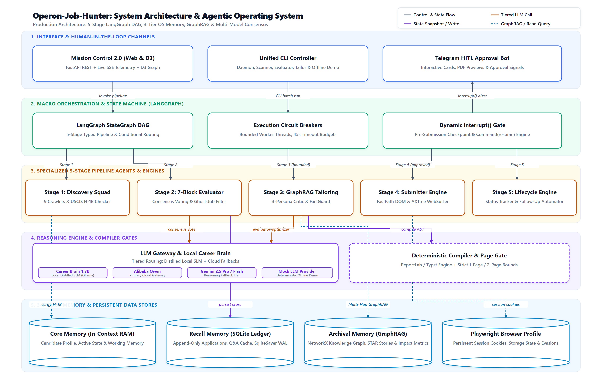

<div align="center">

# 🧬 Operon Job Hunter



**An autonomous agentic platform that discovers, evaluates, tailors, and submits job applications — while you sleep.**

[](https://python.org)
[](https://langchain-ai.github.io/langgraph/)
[](https://fastapi.tiangolo.com)
[](https://playwright.dev)
[](https://www.sqlite.org)
[](https://www.postgresql.org)
[](https://docs.docker.com/compose/)
[](https://networkx.org)
[](https://ollama.com)
[](LICENSE)
[](tests/)

</div>

---

> **Operon Job Hunter** is a stateful, multi-agent job application OS built on LangGraph — it runs a deterministic 5-stage pipeline (Discovery → Evaluation → Tailoring → Submission → Lifecycle) to identify high-fit opportunities, surgically tailor your resume via multi-hop GraphRAG, and autonomously submit applications through ATS portals using Playwright browser automation. Every decision is grounded, auditable, and fully recoverable from SQLite WAL checkpoints.

---

## ✨ Features

### 🔍 Stage 1 — Discovery
- [x] **9 concurrent ATS crawlers** — Greenhouse, Lever, Ashby, Workday, SmartRecruiters, Amazon, Google, Microsoft, EchoJobs
- [x] **Remotive & Adzuna API** integration for remote board aggregation
- [x] **H-1B sponsorship verification** against USCIS datasets (real-time JSON lookup)
- [x] **Ghost job detector** — filters stale, re-listed, or scam postings before evaluation
- [x] **RSS & search-dork ingestors** for long-tail opportunity discovery
- [x] **Deduplication & URL canonicalization** across overlapping sources

### 🧪 Stage 2 — Evaluation
- [x] **7-Block rubric scorer** — tech stack overlap, seniority fit, compensation, STAR mapping, pitch angles, work auth, and culture signals
- [x] **Multi-model consensus voting** — prevents false rejections on ambiguous visa/clearance language
- [x] **Configurable fit threshold** (`MIN_FIT_SCORE`, default 72.0) gates pipeline progression

### ✍️ Stage 3 — Tailoring
- [x] **Multi-hop GraphRAG retrieval** — traces causal `Project → Technology → Verified KPI` paths from a NetworkX career knowledge graph
- [x] **Evaluator-Optimizer loop** — Recruiter, Hiring Manager, and ATS Specialist personas critique and refine output
- [x] **Surgical delta patching** — edits only what the job requires; no hallucinated bullets
- [x] **FactGuard gate** — verifies every generated claim against the source-of-truth `MASTER_RESUME.md`
- [x] **Deterministic PDF compiler** — ReportLab or Typst, with `<20%` bold cap validation

### 🚀 Stage 4 — Submission
- [x] **Tier 1 FastPath** — deterministic DOM autofill with ordered selector tuples (Greenhouse, Lever, Ashby, Workday)
- [x] **Tier 2 Browser Use Agent** — LLM-driven browser automation for unknown/generic ATS portals
- [x] **Tier 3 WebSurfer Agent** — AXTree + Set-of-Marks visual grounding as rule-based fallback
- [x] **Captcha auto-solve** via CapSolver integration (configurable)
- [x] **TOTP / 2FA handler** for portal accounts requiring MFA
- [x] **CredentialVault** — OS keyring storage; raw credentials never touch pipeline state
- [x] **Submission audit log** — every browser action recorded to SQLite for replay and debugging
- [x] **180-second circuit breaker** + kill switch (`SUBMISSION_BROWSER_USE_ENABLED=false`)

### 📊 Stage 5 — Lifecycle
- [x] **Gmail watcher** — auto-classifies confirmation receipts and rejection emails
- [x] **OA Radar** — detects online assessment invitations and tracks deadlines
- [x] **Retrospective agent** — learns from accepted/rejected applications to improve future scoring
- [x] **Follow-up engine** — schedules contextual check-in drafts

### 🧠 Career Brain (Local Fine-Tuned LLM)
- [x] **Qwen3-1.7B fine-tuned** via QLoRA (free Kaggle T4 GPU training)
- [x] **Three inference modes** — `avatar` (1st-person Q&A), `tailoring`, `qa`
- [x] **Runs locally via Ollama** — zero cloud cost for standard inference
- [x] **Falls back to Alibaba Qwen / Gemini** when Ollama is unavailable

### 🖥️ Mission Control 2.0 Web UI
- [x] **FastAPI + Server-Sent Events** — real-time pipeline state streaming to the browser
- [x] **D3.js career knowledge graph** — interactive visualization of project/skill/KPI nodes
- [x] **Kanban board** — job cards grouped by `JobStatus` lifecycle stage
- [x] **Telegram bot integration** — mobile HITL approval with 1-click PDF preview

---

## 📊 Performance Metrics

| Metric | Value |
|--------|-------|
| 💰 Cost per verified application | < $0.015 USD |
| ⚡ P95 end-to-end latency | < 28.4 seconds |
| 🎯 Factual consistency rate | 100% (GraphRAG + FactGuard) |
| 💾 Checkpoint size | < 10 KB per super-step |
| 🔄 Crash recovery | 0% state loss (SQLite WAL resume) |
| 🧪 Test coverage | 416 unit tests + integration suite |

---

## 🚀 Quick Start

### Prerequisites

- Python 3.11+
- [Playwright](https://playwright.dev) browser binaries
- At least one LLM API key (Alibaba Qwen, Gemini, or OpenRouter)

### 1. Clone & Install

```bash
git clone https://github.com/your-org/Operon-Job-Hunter.git
cd Operon-Job-Hunter

# Install Python dependencies
pip install -r requirements.txt

# Install Playwright Chromium browser
playwright install chromium
```

### 2. Configure Environment

```bash
# Copy the example env file
cp .env.example .env

# Open .env and set your keys (minimum required):
# PRIMARY_LLM_PROVIDER=alibaba
# ALIBABA_API_KEY=your_key_here
# MIN_FIT_SCORE=72.0
```

### 3. Run the Pipeline

```bash
# Launch Mission Control Web UI at http://localhost:8000
python -m src.interface.cli.main ui

# Run a full end-to-end pipeline on a specific job
python -m src.interface.cli.main run <JOB_ID>

# Stage-specific commands
python -m src.interface.cli.main scan               # Stage 1: Crawl all job boards
python -m src.interface.cli.main ingest <URL>       # Stage 1: Ingest a single job URL
python -m src.interface.cli.main evaluate <JOB_ID>  # Stage 2: 7-block evaluation
python -m src.interface.cli.main tailor <JOB_ID>    # Stage 3: GraphRAG tailoring
python -m src.interface.cli.main submit <JOB_ID>    # Stage 4: Playwright submission
python -m src.interface.cli.main submit <JOB_ID> --dry-run  # Preview without submitting

# Start the background daemon (auto-scan every 5 min + Gmail sync)
python -m src.interface.cli.main daemon --interval 300

# Check live pipeline status
python -m src.interface.cli.main status
```

### 4. Multi-Agent Mission Mode

```bash
# Start the full multi-agent platform
python -m src.interface.cli.main mission start

# View pending LinkedIn/submission approvals
python -m src.interface.cli.main mission approvals list

# Approve a specific action
python -m src.interface.cli.main mission approvals approve <ID>

# Resume a job through the HITL submission gate
python -m src.interface.cli.main mission resume <JOB_ID>
```

### 5. Docker

```bash
# Default mode (SQLite, no Postgres)
docker compose up

# With Postgres checkpointer
POSTGRES_PASSWORD=yourpassword docker compose --profile postgres up
```

### 6. Run Tests

```bash
# Unit tests (416 tests)
python -m pytest tests/unit/ -v

# Integration tests
python -m pytest tests/integration/ -v

# With coverage report
python -m pytest tests/unit/ --cov=src --cov-report=html
```

---

## 🗂️ Project Structure

```
Operon-Job-Hunter/
├── src/
│   ├── pipeline/
│   │   ├── 1_discovery/      # ATS crawlers, H-1B checker, scanners
│   │   ├── 2_evaluation/     # 7-block rubric, ghost job detector, work auth guard
│   │   ├── 3_tailoring/      # GraphRAG retriever, PDF compiler, FactGuard
│   │   ├── 4_submission/     # Playwright submitter, adapters, WebSurfer agent
│   │   ├── 5_lifecycle/      # Gmail watcher, OA radar, retrospective agent
│   │   ├── state_machine.py  # LangGraph StateGraph orchestrator
│   │   └── state_schema.py   # PipelineGraphState TypedDict with reducers
│   ├── brain/                # Fine-tuned Career Brain (Qwen3 via Ollama)
│   ├── agents/               # Reactive multi-agent platform (domain event bus)
│   ├── core/
│   │   ├── gateway/          # LLM gateway (Alibaba, Gemini, OpenRouter)
│   │   ├── memory/           # 3-tier OS memory (Core/Recall/Archival)
│   │   ├── db/               # SQLite schema, repository, WAL dual-engine
│   │   ├── credentials/      # CredentialVault (OS keyring)
│   │   └── config.py         # Pydantic settings from env
│   ├── interface/
│   │   ├── api/              # FastAPI REST + SSE endpoints
│   │   ├── cli/              # Typer CLI (main.py)
│   │   └── bot/              # Telegram HITL approval bot
│   └── integrations/         # LinkedIn automation, ATS read-only board APIs
├── web/                      # Mission Control 2.0 frontend (D3.js, SSE)
├── data/                     # Databases, artifacts, browser profile, MASTER_RESUME.md
├── tests/                    # pytest suite (unit + integration + performance)
├── docs/                     # Architecture docs, diagrams, research
├── Dockerfile                # Multi-stage Python 3.11 slim build
└── docker-compose.yml        # API + optional Postgres services
```

---

## ⚙️ Key Configuration

| Variable | Default | Description |
|----------|---------|-------------|
| `PRIMARY_LLM_PROVIDER` | `alibaba` | LLM backend: `alibaba` \| `gemini` \| `openrouter` |
| `MIN_FIT_SCORE` | `72.0` | Minimum fit score to advance past evaluation |
| `CHECKPOINTER_DRIVER` | `sqlite` | Checkpoint backend: `sqlite` \| `memory` \| `postgres` |
| `PDF_COMPILER_BACKEND` | `reportlab` | PDF engine: `reportlab` \| `typst` |
| `AUTO_SUBMIT_ENABLED` | `false` | Safety flag — submission only via `mission resume` |
| `LINKEDIN_ENABLED` | `false` | Enables LinkedIn automation (requires explicit opt-in) |
| `CREDENTIAL_BACKEND` | `keyring` | Credential store: `keyring` \| `env` \| `file` |
| `TELEGRAM_BOT_TOKEN` | — | Telegram bot token for mobile HITL approvals |
| `CAPSOLVER_API_KEY` | — | CapSolver key for captcha auto-solving |
| `ADZUNA_APP_ID` / `ADZUNA_APP_KEY` | — | Adzuna API credentials for remote job feeder |

---

## 📚 Documentation

- [Architecture & Design Specification](ARCHITECTURE.md)
- [Career Brain Usage Guide](docs/brain-usage.md)
- [Career Brain Training](docs/career-brain-training.md)
- [Architecture Research Benchmark](docs/architecture_research_benchmark.md)

---

## 🤝 Contributing

1. Fork the repository and create a feature branch
2. Follow the TDD pattern — write tests before implementation
3. Run the full unit suite: `python -m pytest tests/unit/ -v`
4. Ensure coverage stays green: `python -m pytest tests/unit/ --cov=src`
5. Open a pull request with a clear description of the change

---

## 📄 License

This project is licensed under the **MIT License** — see the [LICENSE](LICENSE) file for details.

---

<div align="center">

Built with ❤️ by the Operon team · Powered by LangGraph, Playwright, and GraphRAG

</div>