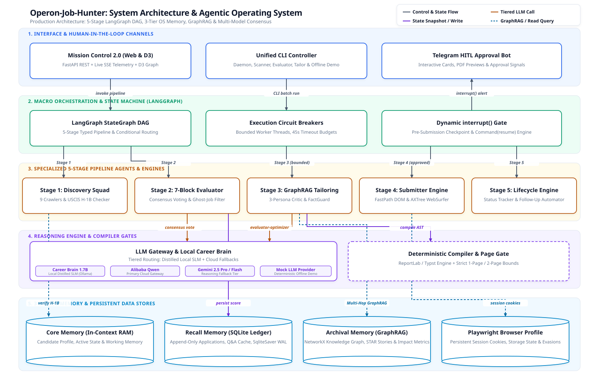

# CareerGraph AI — Autonomous Multi-Agent Job Search & Application Platform

[](tests/unit/)
[](tests/integration/)
[](pyproject.toml)
[](docs/concepts/agent-orchestration.md)
[](LICENSE)
[](docs/demo.md)

CareerGraph AI is a production-grade autonomous multi-agent platform that executes the entire software engineering job hunt: discovering postings across corporate career pages, scoring fit against multi-dimensional rubrics, compiling ATS-optimized resumes grounded in a multi-hop knowledge graph, and automatically completing complex application forms via persistent browser automation with human-in-the-loop oversight.

---

## Architecture Overview

CareerGraph AI orchestrates autonomous workers across a 5-stage Directed Acyclic Graph (DAG) with thread-scoped SQLite WAL checkpointing, circuit-breaker fault isolation, and deterministic anti-hallucination guardrails:



---

## Architectural Concepts Demonstrated

| Engineering Concept | Implementation in Code | Deep-Dive Technical Doc |
|---|---|---|
| **Multi-Agent DAG & Fault Tolerance** | [`src/pipeline/state_machine.py`](src/pipeline/state_machine.py), [`src/core/db/checkpointer.py`](src/core/db/checkpointer.py) | [Multi-Agent Orchestration](docs/concepts/agent-orchestration.md) |
| **Multi-Hop GraphRAG & Anti-Hallucination** | [`src/pipeline/3_tailoring/hybrid_graph_retriever.py`](src/pipeline/3_tailoring/hybrid_graph_retriever.py), [`fact_guard.py`](src/pipeline/3_tailoring/fact_guard.py) | [GraphRAG & FactGuard](docs/concepts/graphrag-llm-patterns.md) |
| **SLM Distillation & Evaluation Gating** | [`src/brain/synthesizer.py`](src/brain/synthesizer.py), [`src/brain/validator.py`](src/brain/validator.py) | [SLM Distillation & Evals](docs/concepts/finetuning-evals.md) |
| **Persistent Browser Automation** | [`src/pipeline/4_submission/submitter_engine.py`](src/pipeline/4_submission/submitter_engine.py), [`fastpath_engine.py`](src/pipeline/4_submission/fastpath_engine.py) | [Submission Engine](src/pipeline/4_submission/README.md) |
| **7-Block Multi-Perspective Evaluation** | [`src/pipeline/2_evaluation/rubric_evaluator.py`](src/pipeline/2_evaluation/rubric_evaluator.py) | [Rubric Evaluator](src/pipeline/2_evaluation/README.md) |
| **Strict Page-Budgeted ATS PDF Engine** | [`src/pipeline/3_tailoring/pdf_renderer.py`](src/pipeline/3_tailoring/pdf_renderer.py) | [ReportLab ATS Compiler](src/pipeline/3_tailoring/README.md) |

---

## Zero-Config Offline Demo (No API Keys Needed)

The repository ships with an offline mock LLM provider and 20 realistic fictional tech roles so you can test the entire pipeline locally without creating accounts or paying for API tokens:

### 1. Installation
```bash
git clone https://github.com/prasadrane/Operon-Job-Hunter.git
cd Operon-Job-Hunter
pip install -r requirements.txt
```

### 2. Run Pipeline Offline (Stages 1 through 3)
```bash
python -m src.interface.cli.main demo --jobs 3 --fresh-db
```
*Seeds fictional jobs into a throwaway SQLite database, runs 7-Block evaluations, generates ATS resumes, and prints score summaries.*

### 3. Run with In-Process Mock ATS Application (Stage 4)
```bash
python -m src.interface.cli.main demo --jobs 3 --with-submit --fresh-db
```
*Boots an ephemeral local Greenhouse/Lever mock portal and tests automated form filling and submission receipt capture.*

### 4. Launch Mission Control Web UI
```bash
python -m src.interface.cli.main ui
```
*Open [http://localhost:8000](http://localhost:8000) to explore the real-time application Kanban, inspect 7-Block rubric audits, and download tailored PDF resumes.*

---

## The 5-Stage Autonomous Pipeline

### Stage 1: Discovery & Ingestion
- **Target Watchlist Scanning:** Monitors configurable company career pages and ATS endpoints.
- **H-1B & Visa Sponsorship Gating:** Automatically cross-references employer USCIS approval data to disqualify non-sponsoring roles before LLM invocation.

### Stage 2: 7-Block Candidate Evaluation
- **Comprehensive Rubric Analysis:** Evaluates postings across 7 distinct dimensions: Role Summary, Skills Match, Seniority Fit, Salary Competitiveness, Personalization Pitch, STAR Behavioral Story Alignment, and Legitimacy / Ghost Job Detection.
- **Scam & Ghost-Job Protection:** Flags postings containing generic contact emails, wire transfer requests, or reposting anomalies.

### Stage 3: GraphRAG Tailoring & Artifact Generation
- **NetworkX Career Graph Retrieval:** Traverses multi-hop relationships (`Role` → `Story` → `Action` → `ImpactMetric`) to ensure claims are grounded in verifiable history.
- **FactGuard Anti-Hallucination:** Strictly rejects fabricated frameworks, false metrics, or contradictory skills.
- **ATS Layout Budgeting:** ReportLab compiler guarantees pixel-perfect 1-page or 2-page PDFs with zero widow words or orphan headers.

### Stage 4: Persistent Browser Submission (HITL Gated)
- **FastPath Form Automation:** Direct DOM filling for standard ATS platforms (Greenhouse, Lever, Ashby, Workday).
- **Human-in-the-Loop Safeguards:** Graph interrupts execution before submission, allowing candidate verification via CLI or Telegram bot.
- **Audit Screenshots:** Captures timestamped full-page screenshots as proof of application submission.

### Stage 5: Lifecycle & Status Sync
- **Application State Tracking:** Tracks application status progression from `APPLIED` and `ACKNOWLEDGED` to `INTERVIEWING` or `REJECTED`.
- **Follow-Up Automation:** Calculates follow-up cadences and drafts contextual outreach emails.

---

## Career Brain: Local Distilled SLM

In addition to cloud LLMs (Gemini, Alibaba DashScope, OpenRouter), CareerGraph AI features **Career Brain**, a domain-specialized 1.7B parameter SLM distilled from teacher models and fine-tuned using QLoRA on free Kaggle NVIDIA T4 GPUs:
- **Zero Cost & Sub-100ms Latency:** Runs locally on CPU/edge devices via Ollama (GGUF Q4_K_M).
- **Evaluation-Gated Synthesis:** High-quality instruction dataset synthesized with strict token-pool grounding filters.
- **Training Walkthrough:** See [docs/career-brain-training.md](docs/career-brain-training.md) for the complete Kaggle fine-tuning notebook instructions.

---

## Test Suite & Verification

The codebase maintains strict Test-Driven Development (TDD) principles across every subsystem:

```bash
# Run 1,256 unit tests
python -m pytest tests/unit/ -q

# Run 95 integration tests
python -m pytest tests/integration/ -q

# Run pre-push privacy and security audit
python scripts/guard_personal.py
```

---

## Project Layout

```
CareerGraph-AI/
├── src/
│   ├── core/                  # Configuration, models, persona, gateway, and database
│   │   ├── gateway/           # Multi-provider LLM failover (Alibaba, Gemini, Mock)
│   │   └── db/                # Repositories and SQLite WAL checkpointer
│   ├── pipeline/              # 5-Stage autonomous pipeline
│   │   ├── 1_discovery/       # Watchlist scanner and H-1B sponsorship verifier
│   │   ├── 2_evaluation/      # 7-Block rubric evaluator and ghost-job detector
│   │   ├── 3_tailoring/       # GraphRAG retriever, FactGuard, and PDF renderer
│   │   ├── 4_submission/      # Playwright submitter and ATS adapters
│   │   ├── 5_lifecycle/       # Follow-up engine and status classifier
│   │   └── state_machine.py   # LangGraph StateGraph DAG orchestrator
│   ├── brain/                 # SLM distillation synthesizer and validator
│   └── interface/             # CLI commands, FastAPI server, and Web UI
├── tests/                     # 1,351 unit and integration tests
├── data/
│   ├── sample/                # Shipped fictional persona (Alex Rivera) & demo data
│   └── brain/                 # Model specifications, benchmark results, and prompts
├── docs/                      # Architectural specs, concept deep-dives, and walkthroughs
└── scripts/                   # Demo runners and personal data security guards
```

---

## Privacy Architecture & Extensibility

CareerGraph AI is architected for strict data isolation:
- **Default Public State:** Ships exclusively with the fictional candidate persona **Alex Rivera** (`src/core/persona.py`).
- **Personal Private Use:** To run the platform with your own career profile, configure `PROFILE_DATA_DIR` in `.env`:
  ```dotenv
  PROFILE_DATA_DIR=/path/to/private/profile
  ```
  The platform will read your private `MASTER_RESUME.md` and knowledge graph directly from your external directory without storing any sensitive personal data within the repository.

---

## License

This project is licensed under the MIT License — see the [LICENSE](LICENSE) file for details.
