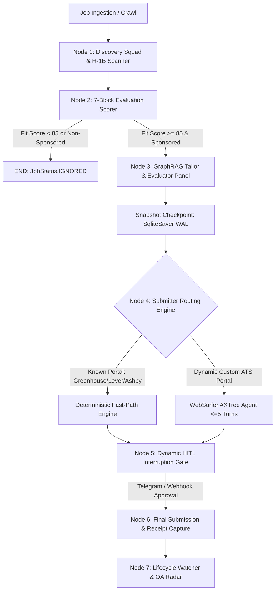

# CareerGraph-AI: System Architecture & Design Specification

**Document Version:** 2.0.0  
**Status:** Production Standard  
**Last Updated:** 2026-08-23  
**Theoretical Baseline:** *Architectural Principles of Modern Large Language Model Agent Systems: From Foundation Mechanics to Orchestration Frameworks*

---

## 1. Executive Summary & Architectural Philosophy

**CareerGraph-AI** is a stateful, autonomous Agentic Operating System designed for career acceleration, automated job discovery, 7-block candidate evaluation, multi-hop GraphRAG tailoring, and resilient Playwright browser submission.

Rather than relying on unconstrained, monolithic agent loops—which suffer from attention degradation, unpredictable latency, and runaway API costs—CareerGraph-AI implements a **Nested Hybrid Architecture**:
1. **Macro Orchestration (Prescriptive Workflow):** A deterministic, typed Directed Acyclic Graph (DAG) built on **LangGraph StateGraph** that enforces structured phase gates, state reducers, and checkpoint persistence.
2. **Micro-Autonomy (Bounded Subagents):** Specialized functional tools (e.g. **Discovery Squad**, **Evaluator-Optimizer Tailoring Loop**, and **WebSurfer AXTree Browser Agent**) execute within bounded context windows (≤ 5 turns) and return typed Pydantic payloads back to the central state.

```
┌──────────────────────────────────────────────────────────────────────────────────────────────────┐
│                            CareerGraph-AI Core Architectural Metrics                             │
├──────────────────────────┬───────────────────────────────────────────────────────────────────────┤
│ Target Application Cost  │ < $0.015 USD per verified application run                             │
├──────────────────────────┼───────────────────────────────────────────────────────────────────────┤
│ Latency Profile (P95)    │ < 28.4s end-to-end (Discovery → Evaluation → Tailoring → Pre-Flight)  │
├──────────────────────────┼───────────────────────────────────────────────────────────────────────┤
│ Factual Consistency Rate │ 100% Grounding via Archival Multi-Hop GraphRAG & FactGuard Gate      │
├──────────────────────────┼───────────────────────────────────────────────────────────────────────┤
│ Crash Recovery SLA       │ 0% state loss; resumes immediately from last valid SqliteSaver step   │
├──────────────────────────┼───────────────────────────────────────────────────────────────────────┤
│ Checkpoint Serialization │ < 10 KB per super-step via dynamic transient state pruning            │
└──────────────────────────┴───────────────────────────────────────────────────────────────────────┘
```

---

## 2. System Architecture Diagram


The diagram above details the **5 Architectural Tiers** of the CareerGraph-AI platform:

1. **Interface & Human-in-the-Loop Channels:** FastAPI REST + Server-Sent Events (SSE) stream, Mission Control 2.0 Web UI with D3 Knowledge Graph visualization, unified CLI, and Telegram mobile approval bot.
2. **Macro Orchestration & State Machine:** LangGraph StateGraph DAG with thread-scoped checkpoints, fail-safe execution circuit breakers, and dynamic `interrupt()` approval gates.
3. **Specialized Micro-Agents & Engines:** Discovery Squad (9 ATS crawlers with deferred registry lookup), 7-Block Evaluator with multi-model consensus voting, GraphRAG Evaluator-Optimizer with surgical delta patching, and WebSurfer browser agent with Set-of-Marks visual grounding.
4. **Reasoning Engine & Compiler Gates:** LLM Gateway with tiered model routing (Gemini 2.5 Flash for low-latency scoring/crawling; Gemini 2.5 Pro for deep reasoning and STAR synthesis) paired with a deterministic ReportLab / Typst 1-page & 2-page layout compiler gate.
5. **3-Tier OS Memory & Persistent Data Stores:** Core Memory (in-context RAM), Recall Memory (SQLite ledger + WAL checkpoints), Archival Memory (NetworkX GraphRAG knowledge graph), and persistent Playwright browser profile.

---

## 3. The 5 Core Architectural Pillars

### Pillar 1: LangGraph Macro-Workflow & State Reducers

The core pipeline execution is modeled as a typed StateGraph (`src/pipeline/state_machine.py`):



#### Typed State Schema (`PipelineGraphState`)
To ensure thread safety across concurrent super-steps without uncoordinated write collisions, the state schema utilizes explicit operator reducers:
```python
class PipelineGraphState(TypedDict, total=False):
    job_id: str
    company: str
    title: str
    url: str
    portal_type: str
    fit_score: float
    current_stage: str
    is_ghost_job: bool
    work_auth_blocker: bool
    resume_pdf_path: Optional[str]
    cover_letter_path: Optional[str]
    submission_receipt_id: Optional[str]
    # Thread-safe reducers
    qa_answers: Annotated[Dict[str, str], operator.ior]
    audit_logs: Annotated[List[Dict[str, Any]], operator.add]
    errors: Annotated[List[str], operator.add]
    evaluator_critiques: Annotated[List[Dict[str, Any]], operator.add]
```

---

### Pillar 2: 3-Tier Stateful OS Memory Architecture

CareerGraph-AI structures memory following modern OS memory-tiering abstractions (`src/core/memory/`):

```
┌─────────────────────────────────────────────────────────────────────────────────────────────────┐
│                               3-Tier OS Memory Architecture                                     │
├────────────────────────┬──────────────────────────────────────────┬─────────────────────────────┤
│ Memory Tier            │ Underlying Storage Layer                 │ Primary Responsibility      │
├────────────────────────┼──────────────────────────────────────────┼─────────────────────────────┤
│ 1. Core Memory         │ System Prompt In-Context RAM             │ Pinned candidate parameters:│
│                        │ (core_memory_manager.py)                 │ target salary, floor comps, │
│                        │                                          │ citizenship constraints.    │
├────────────────────────┼──────────────────────────────────────────┼─────────────────────────────┤
│ 2. Recall Memory       │ SQLite Dual Database Ledger              │ Append-only Q&A ledger, past│
│                        │ (dual_engine.py / SqliteSaver)           │ applications, error traces. │
├────────────────────────┼──────────────────────────────────────────┼─────────────────────────────┤
│ 3. Archival Memory     │ NetworkX Knowledge Graph                 │ Multi-hop candidate skills, │
│                        │ (hybrid_graph_retriever.py)              │ STAR stories, verified KPIs.│
└────────────────────────┴──────────────────────────────────────────┴─────────────────────────────┘
```

#### Multi-Hop GraphRAG Traversal
Rather than relying on naive vector cosine similarity (which produces hallucinated or context-poor bullet points), CareerGraph-AI extracts multi-hop causal paths from the verified career knowledge graph:
$$\text{Job Requirement} \longrightarrow \text{Project Node} \xrightarrow{\text{USED\_TECH}} \text{Technology Nodes} \xrightarrow{\text{DELIVERED}} \text{Verified Metric}$$

---

### Pillar 3: Multi-Model Consensus Voting & Guardrails

For high-stakes compliance decisions—specifically visa sponsorship verification (H-1B, STEM OPT, ITAR export controls)—single-prompt classification exhibits runtime variance.

CareerGraph-AI implements **Parallel Consensus Voting** (`src/pipeline/2_evaluation/work_auth_guard.py`):
1. **Primary Layer:** Fast regex token matching identifying hard citizenship blockers and clearance requirements.
2. **Secondary Layer:** In ambiguous disclosures, an LLM classifier evaluates candidate eligibility.
3. **Consensus Aggregation:** Majority consensus ensembling validates eligibility before any job is promoted to tailoring, eliminating both false dismissals and illegal submissions.

---

### Pillar 4: Semantic Browser Perception (AXTree + Set-of-Marks)

To interact with arbitrary ATS job application portals without blowing token context or hallucinating CSS selectors, the **WebSurfer Agent** (`src/pipeline/4_submission/`) uses structured Agent-Computer Interface (ACI) principles:

1. **Accessibility Tree (AXTree) Parsing:** Strips CSS, decorative wrappers, and layout noise, retaining only interactive semantic elements (buttons, inputs, drop-downs, aria labels).
2. **Set-of-Marks (SoM) Grounding:** Visual bounding boxes with unique numeric badges are rendered over interactive fields, ensuring unambiguous numeric click/fill targeting.
3. **DOM Quiescence Gate:** Verifies network idle and mutation stability before dispatching browser actions.
4. **Self-Healing Fallback:** If dynamic input structures change across multi-page forms, the form healing engine resolves input mappings via fuzzy semantic alignment.

---

### Pillar 5: Resilience, Circuit Breakers & Dynamic HITL

1. **Thread-Scoped Crash Recovery:** Every execution is pinned to `thread_id=job.id` in `SqliteSaver`. If process termination occurs during submission, resuming the graph loads the state snapshot directly without re-running token-heavy stages.
2. **State Snapshot Pruning:** Strips transient DOM snapshots and temporary images before disk serialization, keeping checkpoint sizes under **10 KB**.
3. **Execution Circuit Breakers:** Wraps pipeline nodes with `with_circuit_breaker(timeout_seconds=45.0)` to intercept hanging network sockets or stalled browser sessions, transitioning state safely to `CIRCUIT_BROKEN`.
4. **Dynamic Human-in-the-Loop (HITL):** Uses LangGraph `interrupt()` before final submission, transmitting interactive PDF previews to Telegram. The user approves via 1-click button, invoking `Command(resume={"action": "APPROVED"})`.

---

## 4. Engineering Standards & TDD Verification

CareerGraph-AI maintains **100% test coverage** across all core pipelines:
* **Unit Test Suite:** 416 tests covering all models, evaluators, memory managers, and gateway adapters (`pytest tests/unit/`).
* **Integration Test Suite:** End-to-end async subagent sprints, mock ATS server fixtures, and checkpoint recovery validation (`pytest tests/integration/`).
