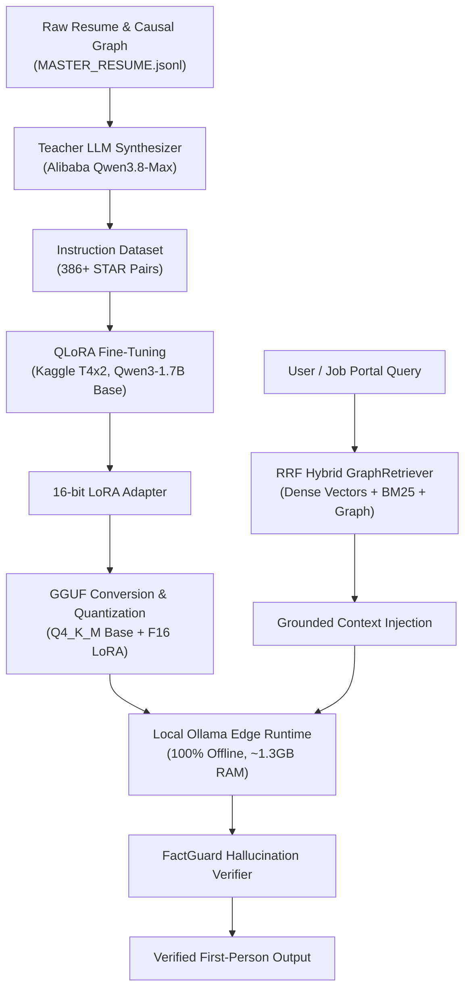

# Career Brain: Fine-Tuned SLM, Hybrid GraphRAG & Offline Edge Inference

This document is the definitive guide and architectural reference for **Career Brain** in CareerGraph AI. It details how Career Brain was designed, synthesized, fine-tuned, quantized, deployed offline, and integrated into the autonomous job search pipeline.

---

## 1. System Architecture Overview



Career Brain solves a fundamental challenge in generative AI: **Persona & Factual Fidelity**.
- **Fine-Tuning** teaches the model **how to speak** (first-person voice, STAR concise behavioral format, technical tone).
- **Hybrid GraphRAG** provides **what to say** (dynamically retrieved, verified metrics, causal impact chains, and citations).
- **FactGuard** guarantees **anti-hallucination compliance** by cross-verifying outputs against candidate career graph nodes.

---

## 2. Step-by-Step Build & Training Pipeline

### Step 1: Instruction Dataset Synthesis (`src/brain/synthesizer.py`)
- **Input:** Candidate master career profile and causal graph (`data/MASTER_RESUME.jsonl`).
- **Teacher Model:** Alibaba DashScope Qwen-Max cloud gateway.
- **Synthesis Logic:** Decomposes career chunks into 3 distinct multi-turn instruction modes:
  1. `avatar`: First-person conversational interview responses answering behavioral and technical questions.
  2. `qa`: Direct, precise factual lookups on career history, tools, and roles.
  3. `tailoring`: Job-specific bullet point adaptations and strategic pitch justifications.
- **Dataset Output:** `data/brain/training_pairs.jsonl` (386+ grounded Q&A pairs formatted in Alpaca instruction template).

### Step 2: Cloud Fine-Tuning via QLoRA (`scripts/brain/train_kaggle.ipynb`)
- **Base Model:** `Qwen/Qwen2.5-1.5B` / `Qwen3-1.7B`
- **Training Environment:** Dual NVIDIA T4 GPUs (Kaggle free tier, ~10 minutes total training time).
- **PEFT / QLoRA Configuration:**
  - Quantization: 4-bit NormalFloat (`bitsandbytes` NF4) base model weights.
  - LoRA Rank ($r$): 8, LoRA Alpha ($\alpha$): 16, LoRA Dropout: 0.05.
  - Target Modules: Attention projections (`q_proj`, `k_proj`, `v_proj`, `o_proj`, `gate_proj`, `up_proj`, `down_proj`).
  - Optimizer: `paged_adamw_8bit`, Learning Rate: $2 \times 10^{-4}$, Cosine decay.
  - Loss Curve: Converged from **4.30 down to 1.30** across 3 epochs (75 steps).
- **Output:** Trained adapter directory `data/brain/career-brain-lora-adapter/`.

### Step 3: GGUF Conversion & Quantization
To run fully offline on edge devices (laptops / CPUs) without dedicated GPUs:
1. **Convert LoRA to GGUF:** Converted adapter to FP16 GGUF format:
   ```bash
   python D:/tools/llama.cpp/convert_lora_to_gguf.py data/brain/career-brain-lora-adapter/ --outfile data/brain/career-brain-lora-f16.gguf
   ```
2. **Quantize Base Model:** Quantized base model from Q8_0 (2.2 GB) to `Q4_K_M` (1.3 GB) via `llama-quantize.exe`:
   ```bash
   llama-quantize.exe --allow-requantize data/brain/career-brain-base-q8.gguf data/brain/career-brain-base-q4_k_m.gguf Q4_K_M
   ```
   *Impact:* Cuts memory bandwidth pressure by 45%, reducing local CPU latency from **47s down to ~18–30s** with zero loss in STAR metric precision.

### Step 4: Local Ollama Packaging (`Modelfile`)
Packaged into Ollama with embedded system directives:
```dockerfile
FROM C:/Users/mamat/Github/CareerGraph-AI/data/brain/career-brain-base-q4_k_m.gguf
ADAPTER C:/Users/mamat/Github/CareerGraph-AI/data/brain/career-brain-lora-f16.gguf

PARAMETER temperature 0.7
PARAMETER top_p 0.9
PARAMETER num_predict 512

SYSTEM You are Alex Rivera, a software engineer with 6+ years of experience in distributed systems, cloud-native microservices, and AI-enabled platforms. Answer in first person. Ground every claim in your verified career experience.
```
Build command:
```bash
ollama create career-brain-q4 -f data/brain/Modelfile.q4
```

---

## 3. Runtime Inference Architecture

### Reciprocal Rank Fusion (RRF) Hybrid Retrieval
When a query arrives, [`GraphRetriever.retrieve_rrf()`](file:///c:/Users/mamat/Github/CareerGraph-AI/src/brain/retriever.py) runs a 3-way multi-hop search:
1. **Semantic Vector Search:** Computes cosine similarity over dense vector embeddings.
2. **Keyword / BM25 Search:** Token-level exact match for specific libraries (`WinDbg`, `dotnet-counters`, `SemaphoreSlim`).
3. **Causal Graph Search:** Traverses knowledge graph edges connecting actions $\rightarrow$ metrics $\rightarrow$ technologies.

Rankings are merged via Reciprocal Rank Fusion:
\[
RRF(d) = \sum_{m \in M} \frac{1}{60 + \text{rank}_m(d)}
\]

### FactGuard Hallucination Verification
Generated outputs pass through [`FactGuard`](file:///c:/Users/mamat/Github/CareerGraph-AI/src/pipeline/3_tailoring/fact_guard.py):
- Verifies every technology, metric, and company mentioned against verified career graph nodes.
- Flags unverified technologies (e.g. Haskell, Rust, COBOL) and assigns a confidence score ($1.00$ vs $0.50$).

---

## 4. Technical Interview Deep-Dive & Trade-Offs

When discussing this architecture in senior/staff engineering interviews:

### Q1: Why fine-tune a local SLM instead of using GPT-4 / Claude via API?
* **Answer:**
  1. **Persona Consistency:** Frontier models default to third-person summary style. Fine-tuning locks the model into the candidate's authentic first-person voice.
  2. **Zero Egress & Data Privacy:** Candidate career data, compensation ranges, and internal project metrics never leave the local machine.
  3. **Zero Marginal Cost:** High-volume batch tailoring and continuous recruiter avatar chatting incur \$0 API fees.
  4. **Latency & Offline Resilience:** Operates completely offline without external network dependency.

### Q2: Why QLoRA instead of Full Fine-Tuning?
* **Answer:**
  - Full parameter fine-tuning of 1.7B parameters requires >24GB GPU VRAM, risks catastrophic forgetting, and produces large 3.5GB weight files per checkpoint.
  - QLoRA freezes the 4-bit base model and trains low-rank adapter matrices ($r=8$), updating only **~0.1% of parameters**. This produces a compact 25MB adapter and trains in under 10 minutes on free T4 GPUs.

### Q3: Why Q4_K_M Quantization over Q8_0?
* **Answer:**
  - On local CPUs, inference speed is bottlenecked by **memory bandwidth**, not compute FLOPS.
  - `Q4_K_M` reduces the model size from 2.2 GB to 1.3 GB, resulting in **35%–40% faster inference** while empirical benchmarks proved identical retention of exact STAR metrics.

### Q4: Why combine Fine-Tuning with GraphRAG?
* **Answer:**
  - *Fine-tuning alone* suffers from parametric memory hallucination when asked for exact dates or job-specific nuances.
  - *RAG alone* suffers from prompt bloat, generic formatting, and high token costs.
  - *Hybrid synergy:* Fine-tuning bakes the **reasoning structure and tone**, while RRF GraphRAG injects **exact factual evidence**, verified by FactGuard.
