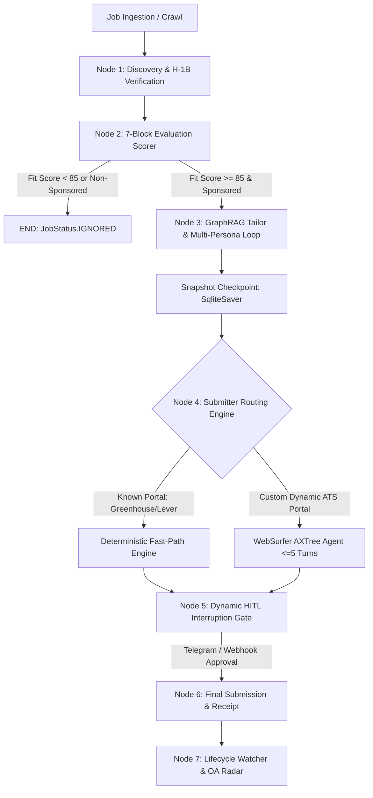
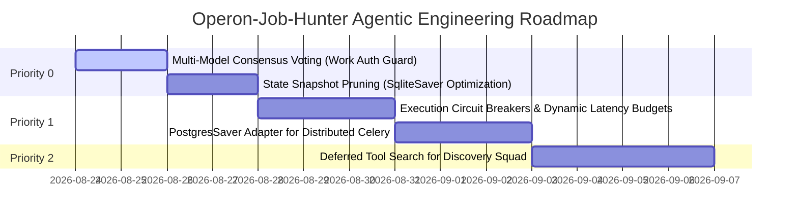

# Operon-Job-Hunter: Architectural Principles & Research Benchmark

**Document Version:** 1.0.0  
**Date:** 2026-08-23  
**Status:** Approved Architectural Baseline  
**Reference Document:** *Architectural Principles of Modern Large Language Model Agent Systems: From Foundation Mechanics to Orchestration Frameworks*

---

## 1. Executive Summary & Architectural Vision

This document provides a comprehensive architectural evaluation and cross-reference of **Operon-Job-Hunter** against contemporary state-of-the-art agentic AI research principles. 

Operon-Job-Hunter implements a **Nested Hybrid Architecture** - combining a macro **Deterministic Directed Acyclic Graph (DAG)** workflow with **isolated micro-autonomous agents** in bounded domains. This design delivers predictability, strict cost governance (<$0.015 per application), zero hallucination on critical facts, and crash resilience.

```
┌────────────────────────────────────────────────────────────────────────────────────────────────────────┐
│                              Operon-Job-Hunter Agentic Operating System                                   │
├──────────────────────────┬──────────────────────────────────────────┬──────────────────────────────────┤
│ Architectural Pillar     │ Research Paper Specification             │ Operon-Job-Hunter Implementation    │
├──────────────────────────┼──────────────────────────────────────────┼──────────────────────────────────┤
│ 1. Workflow Taxonomy     │ Workflows vs. Autonomous Agents          │ Typed LangGraph StateGraph Macro │
│                          │ (Prescriptive code paths vs dynamic loops│ + Bounded Micro-Agents (WebSurfer│
├──────────────────────────┼──────────────────────────────────────────┼──────────────────────────────────┤
│ 2. Core Orchestration    │ Chaining, Routing, Sectioning,           │ Fast-Path Routing + Parallel     │
│                          │ Evaluator-Optimizer Refinement Loops     │ 3-Persona Critic + Delta Patching│
├──────────────────────────┼──────────────────────────────────────────┼──────────────────────────────────┤
│ 3. Multi-Agent Topology  │ Handoffs vs. Agents-as-Tools             │ Manager-Worker (Agents-as-Tools) │
│                          │ (Structured payload contracts)           │ with Typed Pydantic Boundaries   │
├──────────────────────────┼──────────────────────────────────────────┼──────────────────────────────────┤
│ 4. Tool & ACI Design     │ Poka-Yoke, AXTree & Set-of-Marks,        │ Pydantic Validation + Playwright │
│                          │ Programmatic Execution, Deferred Search  │ AXTree + SoM + DOM Quiescence    │
├──────────────────────────┼──────────────────────────────────────────┼──────────────────────────────────┤
│ 5. Memory & Persistence  │ 3-Tier OS Memory + Pregel StateGraph +   │ Core/Recall/Archival GraphRAG +  │
│                          │ Thread-Scoped Checkpoints + HITL dynamic │ SqliteSaver + Telegram HITL Gate │
├──────────────────────────┼──────────────────────────────────────────┼──────────────────────────────────┤
│ 6. Cost & Latency SLA    │ Model Tiering & Compute Budgeting        │ Gemini Flash (S1/2/4) & Pro (S3) │
└──────────────────────────┴──────────────────────────────────────────┴──────────────────────────────────┘
```

---

## 2. Pillar-by-Pillar Comparative Analysis

### Pillar 1: Architectural Taxonomy (Workflows vs. Autonomous Agents)

#### Research Principle
* **Prescriptive Workflows:** Constrain the solution space by enforcing structured control-flow gates, providing deterministic performance, high auditability, bounded cost, and predictable latency.
* **Autonomous Agents:** Dynamically adapt their execution trajectories based on environmental feedback for open-ended problem domains.

#### Operon-Job-Hunter Implementation
Operon-Job-Hunter models the core end-to-end recruitment pipeline as a deterministic **LangGraph StateGraph** ([`state_machine.py`](file:///c:/Users/mamat/Github/Operon-Job-Hunter/src/pipeline/state_machine.py)), spanning 5 distinct stages:
1. **Discovery Squad (`src/pipeline/1_discovery/`):** Concurrent ingestors and canonicalizers.
2. **7-Block Evaluation (`src/pipeline/2_evaluation/`):** Strict visa and rubric scoring.
3. **GraphRAG Tailoring (`src/pipeline/3_tailoring/`):** Evaluator-optimizer resume generator.
4. **Submission Engine (`src/pipeline/4_submission/`):** FastPath + AXTree WebSurfer.
5. **Lifecycle Watcher (`src/pipeline/5_lifecycle/`):** Gmail watcher, OA Radar, and retrospective analysis.



---

### Pillar 2: Core Orchestration Patterns

| Orchestration Pattern | Research Definition | Operon-Job-Hunter Implementation |
| :--- | :--- | :--- |
| **Prompt Chaining** | Sequential single-purpose LLM calls where intermediate outputs are validated before passing to the next stage. | [`resume_generator.py`](file:///c:/Users/mamat/Github/Operon-Job-Hunter/src/pipeline/3_tailoring/resume_generator.py) $\to$ [`ats_optimizer.py`](file:///c:/Users/mamat/Github/Operon-Job-Hunter/src/pipeline/3_tailoring/ats_optimizer.py) $\to$ [`pdf_renderer.py`](file:///c:/Users/mamat/Github/Operon-Job-Hunter/src/pipeline/3_tailoring/pdf_renderer.py). |
| **Routing** | Lightweight classifier evaluating requests and directing them to specialized prompts or model tiers. | [`work_auth_guard.py`](file:///c:/Users/mamat/Github/Operon-Job-Hunter/src/pipeline/2_evaluation/work_auth_guard.py), [`ghost_job_detector.py`](file:///c:/Users/mamat/Github/Operon-Job-Hunter/src/pipeline/2_evaluation/ghost_job_detector.py), and `route_evaluation_result()` in [`state_machine.py`](file:///c:/Users/mamat/Github/Operon-Job-Hunter/src/pipeline/state_machine.py). |
| **Parallelization (Sectioning)** | Breaking larger tasks into independent parallel sub-tasks. | Discovery Squad crawlers ([`scanner.py`](file:///c:/Users/mamat/Github/Operon-Job-Hunter/src/pipeline/1_discovery/scanner.py)) and parallel 3-persona critiques in [`evaluator_panel.py`](file:///c:/Users/mamat/Github/Operon-Job-Hunter/src/pipeline/3_tailoring/evaluator_panel.py). |
| **Parallelization (Voting)** | Executing identical tasks across independent calls for majority consensus. | Multi-Persona Evaluator consensus in [`evaluator_panel.py`](file:///c:/Users/mamat/Github/Operon-Job-Hunter/src/pipeline/3_tailoring/evaluator_panel.py) (Recruiter, Hiring Manager, ATS Spec). |
| **Evaluator-Optimizer Loop** | Iterative refinement loop with concrete metrics and maximum iteration bounds. | [`surgical_optimizer.py`](file:///c:/Users/mamat/Github/Operon-Job-Hunter/src/pipeline/3_tailoring/surgical_optimizer.py) + [`fact_guard.py`](file:///c:/Users/mamat/Github/Operon-Job-Hunter/src/pipeline/3_tailoring/fact_guard.py) bounded to 2 iterations. |

---

### Pillar 3: Multi-Agent Coordination & Delegation

The research contrasts **Handoff Orchestration** (transferring full conversational ownership to a specialist) with **Agents-as-Tools** (manager retains control and invokes bounded worker utilities).

Operon-Job-Hunter implements the **Agents-as-Tools (Manager-Worker)** archetype:
* The root LangGraph StateGraph acts as the top-level orchestrator.
* Subagents ([`websurfer_agent.py`](file:///c:/Users/mamat/Github/Operon-Job-Hunter/src/pipeline/4_submission/websurfer_agent.py), [`evaluator_panel.py`](file:///c:/Users/mamat/Github/Operon-Job-Hunter/src/pipeline/3_tailoring/evaluator_panel.py), [`star_simulator.py`](file:///c:/Users/mamat/Github/Operon-Job-Hunter/src/agents/interview/star_simulator.py)) operate as functional worker tools.
* **Context Isolation:** Subagents return strictly typed Pydantic payloads (e.g. `EvaluatorCritique`, `WebSurferResult`) rather than full conversational history dumps, preventing context bloat.

---

### Pillar 4: Tool Design & Agent-Computer Interface (ACI)

1. **Poka-Yoke (Mistake-Proofing):**
   * All tool parameters and state attributes are validated against strict Pydantic schemas ([`state_schema.py`](file:///c:/Users/mamat/Github/Operon-Job-Hunter/src/pipeline/state_schema.py), [`models.py`](file:///c:/Users/mamat/Github/Operon-Job-Hunter/src/core/models.py)).
   * Malformed outputs from models trigger schema rejection before reaching runtime execution.
2. **Semantic Browser Perception:**
   * Avoids raw HTML/DOM and screenshot token dumps.
   * Uses **Accessibility Tree parsing** ([`axtree_parser.py`](file:///c:/Users/mamat/Github/Operon-Job-Hunter/src/pipeline/4_submission/axtree_parser.py)) + **Set-of-Marks visual bounding boxes** ([`som_annotator.py`](file:///c:/Users/mamat/Github/Operon-Job-Hunter/src/pipeline/4_submission/som_annotator.py)), reducing perception token overhead by $\approx 80\%$.
3. **DOM Quiescence & Stability:**
   * [`dom_quiescence.py`](file:///c:/Users/mamat/Github/Operon-Job-Hunter/src/pipeline/4_submission/dom_quiescence.py) ensures network idle and DOM mutation stability before any agent click or form submission is dispatched.

---

### Pillar 5: Stateful Memory Persistence & Human-in-the-Loop (HITL)

```
┌────────────────────────────────────────────────────────────────────────────────────────────────────────┐
│                               3-Tier LLM-as-an-OS Memory Architecture                                  │
├────────────────────────┬──────────────────────────────────────────┬────────────────────────────────────┤
│ Memory Tier            │ Storage Layer                            │ Functional Purpose                 │
├────────────────────────┼──────────────────────────────────────────┼────────────────────────────────────┤
│ 1. Core Memory         │ System Prompt In-Context RAM             │ Active candidate constraints,      │
│                        │ (core_memory_manager.py)                 │ target salary, sponsorship goals.  │
├────────────────────────┼──────────────────────────────────────────┼────────────────────────────────────┤
│ 2. Recall Memory       │ SQLite Ledger (dual_engine.py)           │ Append-only Q&A history, previous  │
│                        │                                          │ application submissions & states.  │
├────────────────────────┼──────────────────────────────────────────┼────────────────────────────────────┤
│ 3. Archival Memory     │ NetworkX Knowledge Graph (GraphRAG)      │ Multi-hop candidate projects,      │
│                        │ (hybrid_graph_retriever.py)              │ verified metrics, STAR stories.    │
└────────────────────────┴──────────────────────────────────────────┴────────────────────────────────────┘
```

#### Graph Reducers & Checkpointing
* **Schema Reducers:** `qa_answers: Annotated[dict, operator.ior]`, `audit_logs: Annotated[list, operator.add]` prevent write clobbering across parallel branches.
* **Persistent Checkpointer:** `SqliteSaver` keyed to `thread_id=job.id` guarantees crash resilience and idempotent resume.
* **Dynamic HITL Interruption:** Uses LangGraph `interrupt()` prior to final form submission, dispatching an interactive approval card to Telegram ([`telegram_hitl.py`](file:///c:/Users/mamat/Github/Operon-Job-Hunter/src/interface/bot/telegram_hitl.py)) and re-hydrating state via `Command(resume=payload)`.

---

## 3. Prioritized Engineering Improvement Roadmap



### Priority 0: High-Impact / Immediate Enhancements
1. **Multi-Model Consensus Voting on Work Authorization:**
   * *Mechanism:* Run parallel lightweight classification calls (Gemini Flash + secondary validator) with majority voting on complex sponsorship disclosures in [`work_auth_guard.py`](file:///c:/Users/mamat/Github/Operon-Job-Hunter/src/pipeline/2_evaluation/work_auth_guard.py).
   * *Outcome:* Reduces false-rejection rate to near zero on ambiguous job postings.
2. **State Snapshot Pruning for SQLite Checkpointer:**
   * *Mechanism:* Automatically strip intermediate raw DOM trees and base64 screenshot strings from the graph state prior to serializing checkpoints in [`state_machine.py`](file:///c:/Users/mamat/Github/Operon-Job-Hunter/src/pipeline/state_machine.py).
   * *Outcome:* Keeps checkpoint serialization payload under $10\text{ KB}$ per super-step.

### Priority 1: Resilience & Scalability Upgrades
3. **Execution Circuit Breakers & Dynamic Latency Budgets:**
   * *Mechanism:* Enforce maximum token budgets and wall-clock timeouts per super-step in [`state_machine.py`](file:///c:/Users/mamat/Github/Operon-Job-Hunter/src/pipeline/state_machine.py).
   * *Outcome:* Prevents hanging browser sessions on broken or protected web portals.
4. **PostgresSaver Checkpointing for Distributed Workers:**
   * *Mechanism:* Support both `SqliteSaver` (single-node) and `PostgresSaver` (multi-node Celery clusters in [`celery_app.py`](file:///c:/Users/mamat/Github/Operon-Job-Hunter/src/core/distributed/celery_app.py)).
   * *Outcome:* Allows horizontal scaling of worker pools across multiple cloud instances.

### Priority 2: Advanced Tool Capabilities
5. **Deferred Tool Search for Aggregators:**
   * *Mechanism:* Dynamic registry querying at runtime (`ToolSearchTool`) based on job URL domains.
   * *Outcome:* Keeps prompt context slim when scaling from 5 to 50+ job portal crawlers.

---

## 4. Verification & Testing Standards

All future enhancements must strictly adhere to the project's **Test-Driven Development (TDD)** guidelines:
1. Write failing unit and integration tests under `tests/unit/` and `tests/integration/`.
2. Verify state reducer idempotency and thread checkpoint recovery.
3. Validate token economics and latency thresholds.
